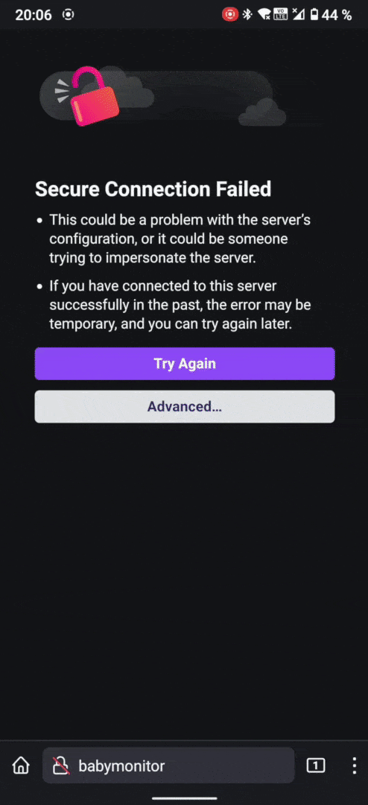
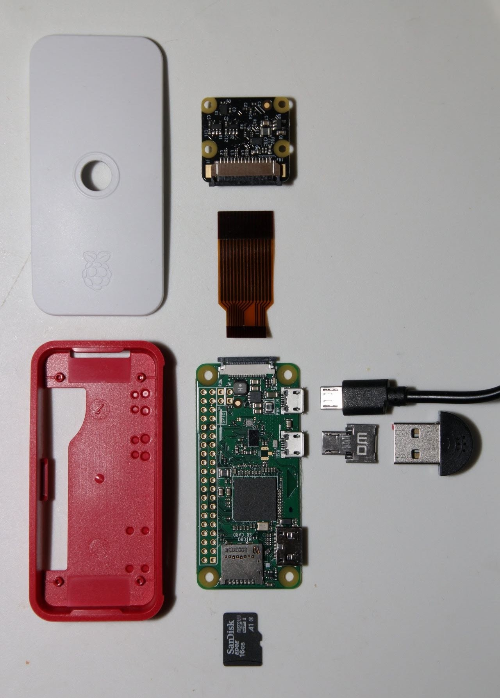
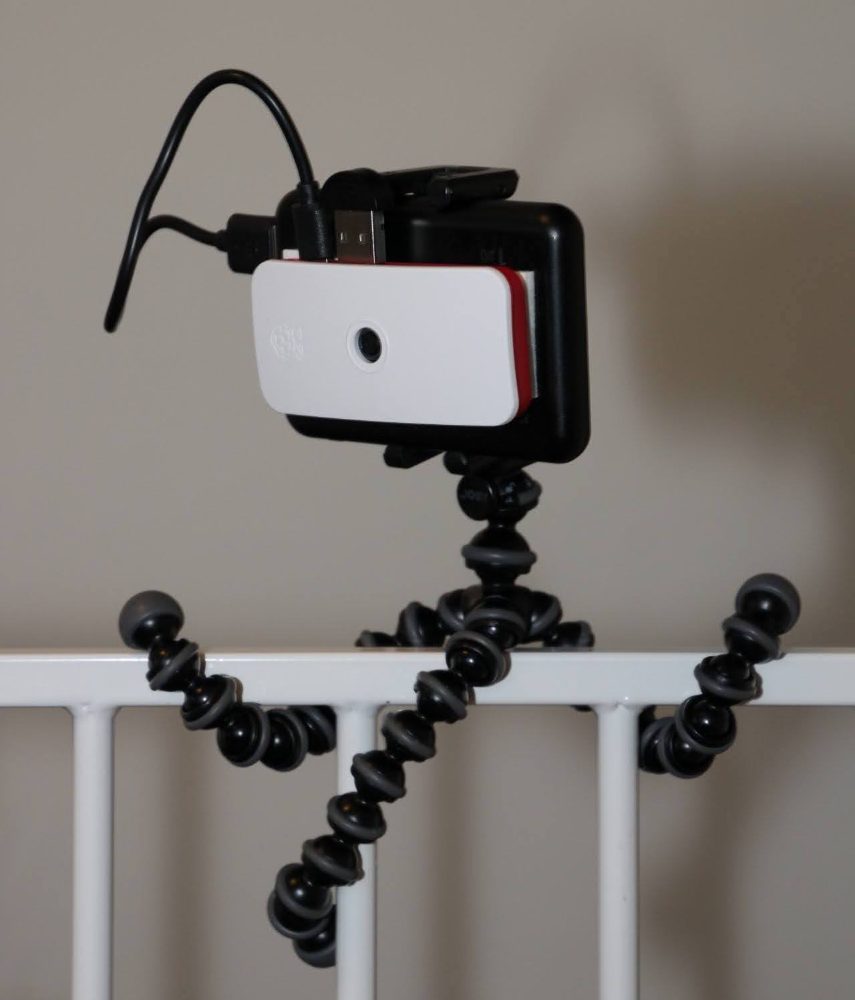

# Raspberry Pi baby monitor

<details open>
<summary>Click to toggle animation</summary>

</details>

The purpose of this project is to make use of the great flexibility and availability of the [Raspberry Pi](https://www.raspberrypi.org/) mini-computer to create a user friendly and capable yet inexpensive baby monitor or babycall. Equipped with a small microphone and optionally an integrated camera, the Pi is controlled through a local web site accessible with a phone or computer on a wireless network. It can then stream audio or video to this web site, or listen passively and give a notification once the baby is crying.

## Features

* Fully DIY and open source. Simply obtain a Raspberry Pi and a few peripherals (see [Equipment](#equipment)), download one of the pre-built disk images and install it on the Pi (see [Installation](#installation)).
* Controlled through a web browser from any device on the local network. No special reciever required, and no client software to install.
* Can either be connected to the home Wi-Fi or provide its own wireless access point.
* Detects baby crying using either a simple loudness threshold or a neural network trained on Google's [AudioSet](https://research.google.com/audioset/) dataset to distinguish between crying, babbling and ambient sounds.
* Live audio streaming and optionally video streaming in up to 1080p resolution.
* Low power consumption (see [Power consumption](#powe dr-consumption)), enabling tens of hours of battery life when powered by even a modestly sized portable power bank.

## Equipment



* A Raspberry Pi computer, preferably a [Raspberry Pi Zero W](https://www.raspberrypi.com/products/raspberry-pi-zero-w/), which is priced at around $10. The non-W version of the Pi Zero will not do, as it does not have an inbuilt network adapter. Other, more powerful but pricier models like the [Zero 2 W](https://www.raspberrypi.com/products/raspberry-pi-zero-2-w/), [3B/3B+](https://www.raspberrypi.com/products/raspberry-pi-3-model-b-plus/) or [4B](https://www.raspberrypi.com/products/raspberry-pi-4-model-b/) can also be used.
* A MicroSD card with at least 8 GB of storage, as well as a MicroSD to USB adapter so that you can connect the card to your computer.
* A [5.1V  power supply with Micro USB plug](https://www.raspberrypi.com/products/micro-usb-power-supply/) for Pi Zero 1/2 or Pi 3, or [with USB-C plug](https://www.raspberrypi.com/products/type-c-power-supply/) for Pi 4. These also cost around $10. To avoid the need for a wall outlet, a 5V power bank with an appropriate cable can be used instead.
* A case for the Pi, e.g. [this](https://www.raspberrypi.com/products/raspberry-pi-zero-case/) for Pi Zero, [this](https://www.raspberrypi.com/products/raspberry-pi-3-case/) for Pi 3B or [this](https://www.raspberrypi.com/products/raspberry-pi-4-case/) for Pi 4B. These official cases cost around $6. Note that the Zero models have a smaller form factor, and unlike for the non-Zero models their official case comes with a convenient mount and hole for the [Pi Camera](https://www.raspberrypi.com/products/camera-module-v2/).


* A [USB microphone](https://www.adafruit.com/product/3367), with an [adapter to Micro USB](https://www.adafruit.com/product/2910) if using a Pi Zero 1/2. Together these cost around $9. Other USB microphones should work as well, but have not been tested.
* For optional video streaming, the [Raspberry Pi Camera Module 2](https://www.raspberrypi.com/products/camera-module-v2/), or its [NoIR](https://www.raspberrypi.com/products/pi-noir-camera-v2/) variant is required. These are priced at around $27. The NoIR version has no infrared blocking filter, making the camera more sensitive at the expense of colour accuracy. (Hence the NoIR version is arguably the best choice for use in a baby monitor.) Note that the cheaper ZeroCam is not supported.
* For mounting the Pi on a bed or a stroller, a flexible phone tripod can be of great use.

## Practical info

### Powering on and off

The Raspberry Pi will start as soon as you connect it to power. When finished, use the [web application](#the-web-application) to shut down the Pi. **Avoid shutting down by simply unplugging the power supply, as this may corrupt the SD card.** To start the Pi again after shutting down, remove and then reinsert the power cable.

### Local Wi-Fi or wireless access point

The only way of communicating with Pi is over a wireless network. This can be done in two ways. It can be connected to a local Wi-Fi network and thus be controlled by e.g. a phone on the same network. Or it may act as an access point by creating its own network to which you can connect your phone. In this way the baby monitor may be used even if there is no Wi-Fi available.

You can switch between the two networking modes using the [web application](#the-web-application). The Pi will also switch automatically depending on whether it finds a network to connect to, so as not to leave you without a way of controlling it.

### Mini USB Microphone

The Mini USB Microphone linked in the [Equipment](#equipment) section is very affordable, but this comes at the cost of poor audio quality. Hence, to make the audio interpretation as reliable as possible, avoid placing the baby monitor too far from the baby.

In order to fit the Mini USB Microphone next to the Micro USB power plug on a Pi Zero, you may have to cut away some of the rubber on the side of the power plug.

## Installation

> **_Note:_** This section describes installation using a pre-built system image. You can also install the software manually, as described [here](#manual-setup).

1. Download the `babymonitor-v*.zip` archive from the [latest release](https://github.com/lars-frogner/babymonitor/releases/latest) and extract the `babymonitor.img` file from the ZIP archive. The image is compatible with all Raspberry Pi models.

2. Connect your Pi's MicroSD card to your computer.

3. Download and launch the [Raspberry Pi Imager](https://www.raspberrypi.com/software/).

4. In the Imager, click `CHOOSE OS` -> `Use custom` and select the extracted `babymonitor.img` file.

5. Click `CHOOSE STORAGE` and select your MicroSD card.

6. Click `WRITE` and wait for the Imager to finish.

7. Eject the MicroSD card and insert it into your Pi (make sure the Pi is turned off).

8. Power up the Pi. After some time a new wireless network called `babymonitor` will appear. Connect to it using the default password; `babymonitor`.

9. You are now ready to control the baby monitor using [the web application](#the-web-application).

## The web application

### Accessing the web application

You can control the baby monitor through a web application that is accessed by opening the URL https://babymonitor in a browser. This requires that you are connected to the Pi's wireless access point, or to same local wireless network as the Pi.

> **_Note:_** If the above URL does not work, see [troubleshooting](#troubleshooting).

Upon loading the website, your browser will typically show a warning about the site not being secure. This is expected and can typically be bypassed by clicking `Advanced` -> `Continue anyway` or something similar. While this is perfectly secure in the context of communicating with a device on the local network, **you should generally not bypass such warnings encountered when browsing the internet**.

> **_Note:_** Both the `https` and `http` protocol is supported, but `https` is recommended because it encrypts the communication. However, because the baby monitor only uses the local network and thus is not connected to the internet, it has to use a [self-signed certificate](https://en.wikipedia.org/wiki/Self-signed_certificate) for the `https` protocol. Since such certificates are not as secure as certificates validated by a third party, they cause most browsers to emit warnings.

### Signing in

A password is required to sign in to the web application. If you used a [pre-built system image](#installation) to install the baby monitor software on the Pi, the default password is `babymonitor`. If you did a [manual installation](#manual-setup), you specified this password during the setup. It is a good idea to [change this](#changing-passwords) in the network settings after you have signed in the first time.

### Changing passwords

> **_Note:_** This is most relevant if you installed a [pre-built system image](#installation).

For security, you should change the baby monitor passwords to something other than the default values. There are three separate passwords that should be changed (all with `babymonitor` as the default value). These are the passwords for (1): connecting to the access point, (2): signing in to the web application and (3): performing privileged actions on the server, like logging in with SSH. All can be changed in the web application.

In the navigation menu, click `Settings` -> `Network settings` to go to the network settings page, where there are options to change the access point password and the website password. After doing so, go to the system settings page by clicking `Settings` -> `System settings`. Here you can change the server password. When finished, reboot the Pi by clicking `Server` -> `Reboot`.

### Basic operation

The main page of the web application has buttons for switching between different modes of operation. The available modes are as follows:

**Standby**

Indicated by a crescent moon. The Pi is idle and does as little as possible. A button is available for testing your connection to the Pi. It will measure the latency and bandwidth of data transfer, and use this to show an indication of which functionality should work well with your current connection.

**Notify**

Indicated by a bell. The Pi will record and process audio, and send a notification when the baby is crying. You can also view a visual representation of how the Pi is interpreting the current sounds, as it uses a neural network to distinguish between (1): baby cries, (2): babbling and laughing and (3): other ambient sounds.

**Listen**

Indicated by a microphone. The Pi will record and stream audio directly to the web application for you to hear. You can also watch live what the audio waveform or frequency spectrum looks like.

**Observe**

Indicated by a camera. The Pi will capture and stream video and audio directly to the web application. This mode will be unavailable if the Pi does not have a camera connected.

## Power consumption

Below are measured values of the power consumption of a Pi Zero baby monitor in different modes of operation (with default settings).

| Mode                             |   Power (W) |
| -------------------------------- | ----------: |
| Standby                          |        0.55 |
| Cry detection (threshold)        |        0.60 |
| Cry detection (small neural net) | 0.60 - 0.70 |
| Cry detection (large neural net) | 0.60 - 0.85 |
| Audio streaming                  |        0.70 |
| Video streaming (480p)           |        1.25 |
| Video streaming (720p)           |        1.55 |
| Video streaming (1080p)          |        1.70 |

Based on this, a 5000mAh 5V battery powering a Pi Zero baby monitor should last between 15 hours (if continuously streaming full HD video) and 45 hours (if in standby) on a single charge.

## Manual setup

1. Write a [Raspbian Buster Lite image](https://downloads.raspberrypi.org/raspbian_lite/images/raspbian_lite-2020-02-14/2020-02-13-raspbian-buster-lite.zip) to a MicroSD card, using for instance the [Raspberry Pi Imager](https://www.raspberrypi.com/software/).

2. Create an empty file called `ssh` and a text file called `wpa_supplicant.conf` containing
    ```
    ctrl_interface=DIR=/var/run/wpa_supplicant GROUP=netdev
    update_config=1
    country=<2-character country code>

    network={
        ssid="<network name>"
        psk="<network password>"
    }
    ```
    in the `boot` directory on the MicroSD card. Insert the country code, SSID and password for your local wireless network. Make sure to keep the double quotes around the password. The `wpa_supplicant.conf` file lets the Pi connect to the local wireless network, and the `ssh` file enables us to acces to the Pi remotely via SSH.

3. Insert the SD card into the Raspberry Pi.

4. Open a terminal and access the Raspberry Pi using SSH (the password is `raspberry`):
    ```
    ssh pi@raspberrypi
    ```
    Try adding `.local`, `.home` or `.lan` after `raspberrypi` if it doesn't work.

5. When you have successfully SSH'ed into the Pi, proceed by updating the package lists and installing Git:
    ```
    sudo apt -y update
    sudo apt -y install git
    ```

6. Use Git to clone the `babymonitor` source code repository:
    ```
    git clone https://github.com/lars-frogner/babymonitor.git
    ```

7. (Optional) Edit environment variables in `babymonitor/config/setup_config.env`. The default version of the file looks like this:
    ```bash
    # The name of the Linux user that will control the baby monitor
    # (this is best left as pi)
    BM_USER=pi

    # This name will be used as the domain name of the baby monitor website and the name of the wireless access point
    BM_HOSTNAME=babymonitor

    # The wifi channel to use for the wireless access point
    # (try changing to another channel between 1 and 11 if the connection to the access point is unreasonably unstable)
    BM_AP_CHANNEL=7

    # The country code that will be used for networking
    BM_COUNTRY_CODE=NO

    # The time zone that the device should use
    BM_TIMEZONE=Europe/Oslo

    # Set to 1 to enable debugging features
    BM_DEBUG=0
    ```
    Change the values to your preference.

8.  Run the setup script:
    ```
    babymonitor/setup.sh
    ```
    You will be prompted to change the password for the `pi` user. During further execution of the script you will be asked to create a couple of new passwords. First for the baby monitor website, and then for the wireless access point. The Pi will reboot when finished.

After the Pi has rebooted you will be able to SSH in using the new hostname (defined by `BM_HOSTNAME` in `babymonitor/config/setup_config.env`) and the password for the `pi` user you entered in the previous step:
```
ssh pi@<hostname>
```

## Troubleshooting

### I can't access the web application at https://babymonitor when the baby monitor is connected to the local Wi-Fi

In the above URL, `babymonitor` is the hostname of the Pi. Many routers automatically append a suffix like `.local`, `.home` or `.lan` to the hostnames of the devices on its network, so if the short version of the URL doesn't work, try adding one of the suffixes. No suffix is required when connected to the Pi's access point.

### The web application stops working on mobile when the screen is turned off

This happens because the browser goes to sleep when the screen is turned off. There is unfortunately no way for a web application to prevent this. However, the web application will try to prevent the mobile device from turning off the screen automatically while the baby monitor is not in standby and the browser window is visible. Note that if you have reloaded the page while not in standby or if the mode was changed by another user, this anti-sleep function will not be activated in your browser until you touch the button for the currently active mode.

### I can sign in to the web application but there is no content

This may happen if you use an ad blocker. Make sure the ad blocker is disabled for the URL of the web application.
